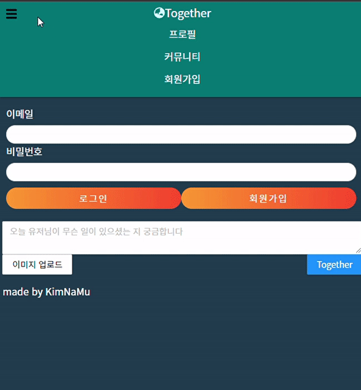

# emotion과 react-component 같이 쓰기

## 1. npm trends

### npm trends를 찾아보면 emotion이 styled-components의 다운로드 수를 앞서고 있는 것을 알 수 있다.


### 실제로 emotion을 이용해본 결과 styled-components를 사용할 줄 아시는 분들이라면 금방 익히실 수 있을 거라고 생각한다.

---

## 2. emotion with react

emotion을 react와 같이 사용하기 위해서는 일단 emotion을 node_modules에 설치해야한다.

```
// Node Package Manager 설치
npm i @emotion/css
npm i @emotion/react

//styled-components와 유사한 방식의 사용을 위해
npm i @emotion/styled
```

설치가 완료되면 사용해야할 컴포넌트에 import 해야한다.

```jsx
import { css, jsx } from "@emotion/react";
```

같이 사용하는 예제 코드를 공식문서에 있는 글과 같이 사용하자면

```jsx
import { css, jsx } from '@emotion/react'

const divStyle = css`
  background-color: hotpink;
  font-size: 24px;
  border-radius: 4px;
  padding: 32px;
  text-align: center;
  &:hover {
    color: white;
  }
`

export default function App() {
  return <div css={divStyle}>Hover to change color.</div>}
```

이런식으로 styled-components와는 다르게 사용할 태그에 props를 주는 방법도 있다.

실제로 이를 사용하면 태그 이름을 바꾸지 않아도 된다.

styled방식을 이용하면

```jsx
import styled from '@emotion/styled'

const DivStyle = styled.div`
  background-color: hotpink;
  font-size: 24px;
  border-radius: 4px;
  padding: 32px;
  text-align: center;
  &:hover {
    color: white;
  }
`

export default function App() {
  return <DivStyle>Hover to change color.</DivStyle>
}
```

styled-components에서 많이 사용하던 코드니 익숙하실 거라고 본다.

---

## 3. *jsx props로 주는 state를 css에서 이용*

emotion, styled-components 전부 이용가능

포스팅하고 싶었던 핵심은 이것인데

```jsx
const [openedMenu, setOpenedMenu] = useState(false);
const onCLickMenu = useCallback(() => {
    setOpenedMenu((prev) => !prev);
  }, []);
```

메뉴창을 열리게 하는 state가 있다.

아래 콜백함수는 메뉴가 열려있으면 메뉴 버튼을 눌렀을 때 닫고  닫혀있으면 메뉴 버튼을 눌렀을 때 여는 코드이다.



이것을 구현하기 위해서

```jsx
const List = styled.ul`
  display: flex;
  justify-content: center;
  margin-left: 40px;
  @media screen and (max-width: 768px) {
    flex-direction: column;
    width: 100%;
    margin-left: 0;
    align-items: center;
//반응형 컴포넌트를 위한 코드
    display: ${({ openedMenu }) => (openedMenu ? "none" : "flex")};
  } ;
`;
```

이런 식으로 styled를 짜고

```jsx
<List openedMenu={openedMenu}>
        <Item>
          <Link href="/profile">
            <MenuContent>프로필</MenuContent>
          </Link>
        </Item>
        <Item>
          <Link href="/">
            <MenuContent>커뮤니티</MenuContent>
          </Link>
        </Item>
        <Item>
          <Link href="/signup">
            <MenuContent>회원가입</MenuContent>
          </Link>
        </Item>
      </List>
```

이렇게 props에 넣어준다면 가능하다 포인트는 prop name과  prop을 사용하여

name은 styled-component에게 prop은 state를 다룰 수 있게끔 하여 컨트롤 하는 것이다.

이러한 방식은 emotion/styled가 아닌 styled-components에서도 사용할 수 있고 인터랙티브 한 웹을 제작하기 위해 알아두면 좋은 방식이다.

### 첫 글은 emotion 사용,  emotion에서 styled 이용, styled-components를 사용할 때 jsx props와 연결하는 방법을 포스팅하였다.

### 다음 포스팅은 react에서 많이 사용되는 useMemo와 useCallback에 대한 내용을 최대한 이해가 와닿게끔 포스팅해보겠다.